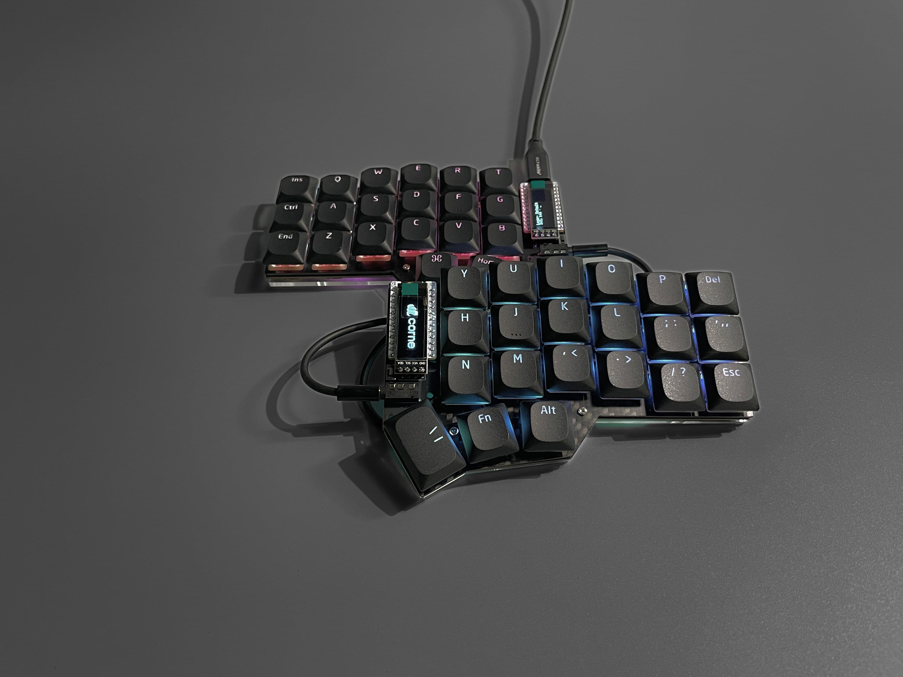

# Corne GLP (Gateron Low Profile)

The Corne GLP (Gateron Low Profile) is a variant of the Corne keyboard, originally created by [foostan](https://github.com/foostan/crkbd "foostan"). It supports Gateron low-profile key switches (KS-27 and KS-33). The original Corne firmware can be used with this keyboard.

## Photos

## Bill of Materials (BOM)
### Required

| Name | Count | Remarks |
|:-|:-|:-|
| PCB | 1 set | |
| Top plate | 2 sheets | 1.2mm thick |
| Bottom plate | 2 sheets | |
| OLED cover | 2 sheets | |
| Pro Micro or equivalent | 2 |  |
| TRRS jack | 2 | |
| Reset switch | 2 | |
| Diodes | 42 | SMD Only (SOD-123 Package) |
| Gateron Low Profile Hotswap Sockets | 42 |  |
| Key switches | 42 | Only compatible with Gateron KS-33 / KS-27 |
| Keycaps | 42 pieces | 1u 40 pcs, 1.5u 2 pcs [Keycaps Comparison](https://showcase.beekeeb.com/the-keycaps-of-gateron-low-profile-key-switches-and-kailh-choc-v1-key-switch/) |
| Spacer M2 5mm | 10 pieces | For Case assembly |
| Spacer M2 9mm | 4 pieces | For OLED cover |
| Screw M2 4mm | 28 screws | |
| Rubber feet | 8 pieces | |
| TRRS (4 poles) cable | 1 |  |
| Micro USB or USB-C cable | 1 | Avoid charge-only cables |

### Optional

| Name | Count | Remarks |
|:-|:-|:-|
| OLED module | 2 | |
| SK6812MINI-E | 42 | LEDs for Backlight |
| WS2812B | 12 | LEDs for Undergrow |
| Microcontroller/OLED Sockets | 1 |  |
| Microcontroller Pins | 48 | Alternative: Diode/Resistor legs |
| OLED Headers | 1 | Soldered to OLED module |

## Plates
It is compatible with Corne v3 top and bottom plates.
* [Corne Top / Bottom Plates](https://github.com/foostan/crkbd/tree/main/plates/pcb)

## Ordering Parts

[DIY kits / Prebuilt Keyboards](https://shop.beekeeb.com/product/corne-glp-kit/) are available at https://beekeeb.shop.

## External Libraries
* [https://github.com/siderakb/key-switches.pretty](https://github.com/siderakb/key-switches.pretty)
* [https://github.com/foostan/kbd](https://github.com/foostan/kbd)

## More Information
* [A great doc about Gateron Low Profile switches writen by Rafael Yumagulov](https://ergonautkb.github.io/docs/switches/gateron-low-profile/)
* [More photo of Corne GLP](https://showcase.beekeeb.com/corne-glp/)
* [Keycaps for Gateron Low Profile Key Switches](https://showcase.beekeeb.com/the-keycaps-of-gateron-low-profile-key-switches-and-kailh-choc-v1-key-switch/)
